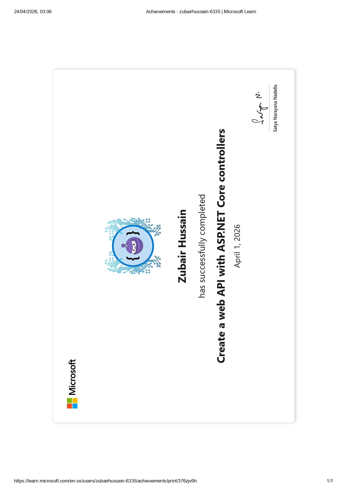
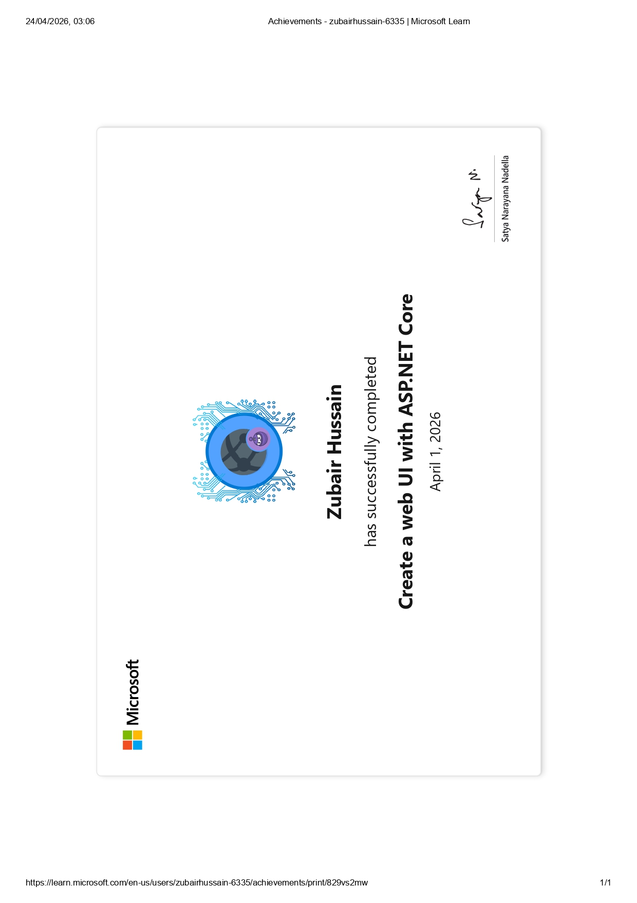
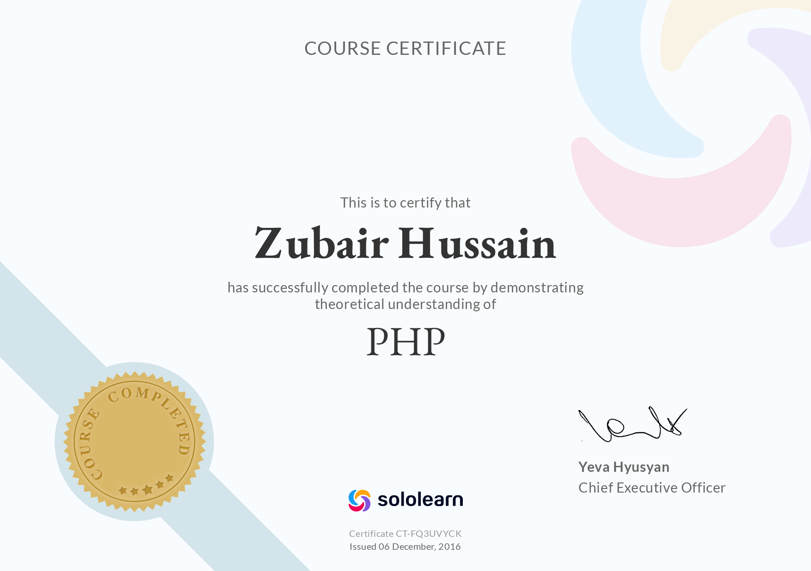
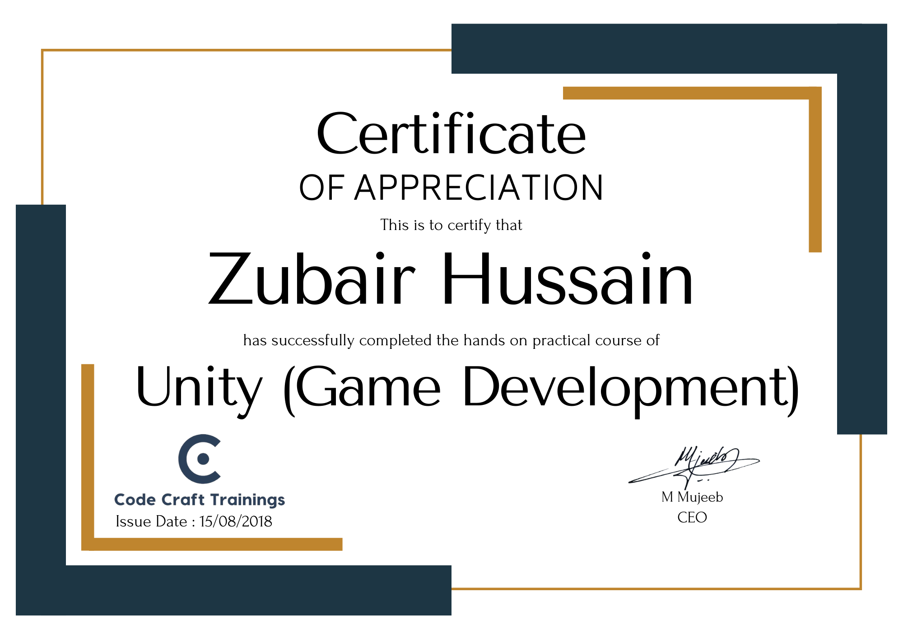

# `< Zubair Hussain />`

### Full Stack Software Engineer

---

---

## 🧑‍💻 About Me

> *"Developing robust applications that combine performance, security, and great design."*

I'm a **Full Stack Software Engineer** specializing in **C# and JavaScript development**

<table>
<tr>
<td width="33%" valign="top">

**🌐 Full Stack Development**  
- .NET Core · ASP.NET MVC · C#  
- React JS · JavaScript · TypeScript  
- REST APIs · Microservices  
- SQL Server · PostgreSQL · Entity Framework  
- Three.js · Phaser.js  

</td>

<td width="33%" valign="top">

**🧠 DevOps & Tools**  
- Git · GitHub    
- CI/CD Pipelines  
- Azure · Docker Basics  
- Agile · Jira  

</td>

<td width="33%" valign="top">

**🛒 CMS & E-commerce**  
- WordPress · WooCommerce  
- Shopify   
- Custom Themes & Plugins  
- Elementor · SEO Basics  
- Payment Gateway Integration  

</td>
</tr>
</table>

        
---

<h2>📬 Contact Me &nbsp;<i>(click to expand)</i></h2>

 

| Channel | Link |
|--------|------|
| 🌐 **Website** | [zubairhussain.netlify.app](https://zubairhussain.netlify.app/) |
| ✉️ **Email** | [zubairhussain404@gmail.com](mailto:zubairhussain404@gmail.com) |
| 📅 **Book a Call** | [Calendly — 30 min](https://calendly.com/zubairhussain404/30min) |

 

---

<h2>🏆 Certifications &nbsp;<i>(click to expand)</i></h2>

 

<table>
<tr>
<td align="center" width="50%">
   
  <b>Microsoft .Net Web API</b>
</td>
<td align="center" width="50%">
   
  <b>Microsoft .Net Web UI</b>
</td>
</tr>

<tr>
<td align="center" width="50%">
   
  <b>Machine Learning</b>
</td>
<td align="center" width="50%">
   
  <b>Python Development</b>
</td>
</tr>

<tr>
<td align="center" width="50%">
   
  <b>C# Programming</b>
</td>
<td align="center" width="50%">
   
  <b>PHP Development</b>
</td>
</tr>

<tr>
<td align="center" width="50%">
   
  <b>CSS3 & Styling</b>
</td>
<td align="center" width="50%">
   
  <b>HTML5 Fundamentals</b>
</td>
</tr>

<tr>
<td align="center" width="50%">
   
  <b>Unity Game Development</b>
</td>
<td align="center" width="50%">
</td>
</tr>
</table>

---

<!-- ========================================
     REGION: Portfolio Section - START
     ======================================== -->
<!--

<h2>💼 Portfolio &nbsp;<i>(click to expand)</i></h2>

 

<h3>🎮 Unity &amp; Game Portfolio &nbsp;<i>(click to expand)</i></h3>

 

<table>
<tr>
<td align="center" width="50%">

### 🛒 Super Mart Frenzy

An **arcade idle supermarket management game** where players grow a small mart into a bustling empire. Manage inventory, upgrade racks, and optimize store layouts to maximize profits.

</td>
<td align="center" width="50%">

### 🧩 Fitness Match

A **colorful casual puzzle game** where players tap same-colored cubes, trigger explosive boosters, and progress through increasingly challenging levels.

</td>
</tr>
<tr>
<td align="center" width="50%">

### 💈 Barber Simulator

A **fun toonish 3D simulation game** — take on haircut and beard styling requests with precision tools, time challenges, and progressive difficulty.

</td>
<td align="center" width="50%">

### 🚗 Dare Drive

An **endless toon-style arcade racing game** — dodge highway traffic, upgrade cars, and race through dynamic environments across multiple modes.

</td>
</tr>
<tr>
<td align="center" width="50%">

### 🏥 Carefort

A **2D hospital simulation game** — step into Dr. Alice's shoes. Diagnose patients, perform surgeries, handle emergencies, and build a thriving hospital.

</td>
<td align="center" width="50%">

### 🍳 Kitchen Merge

A **cozy 2D merge & décor puzzle game** — combine matching items, craft kitchen goodies, decorate your café, and advance through offline merge challenges.

</td>
</tr>
</table>

📂 **[See More Projects on Google Drive →](https://drive.google.com/drive/folders/1g4GtXKvYJ1Ixjrn2TXf38okHin20zanF)**

 

<h3>🌐 Full Stack Portfolio &nbsp;<i>(click to expand)</i></h3>

 

> 🚧 Projects coming soon — visit [zubaircodes.com](https://zubaircodes.com/) for live demos.

 

<h3>🔷 WordPress Portfolio &nbsp;<i>(click to expand)</i></h3>

 

> 🚧 Projects coming soon — visit [zubaircodes.com](https://zubaircodes.com/) for live demos.

 

<h3>🛍️ Shopify Portfolio &nbsp;<i>(click to expand)</i></h3>

 

> 🚧 Projects coming soon — visit [zubaircodes.com](https://zubaircodes.com/) for live demos.

 

-->
<!-- ========================================
     REGION: Portfolio Section - END
     ======================================== -->

---

**Tech Stack**

### 🔵 Backend (Primary)

### 🟣 Frontend / Interactive

### 🟢 Databases

### 🟠 DevOps / Deployment

### ⚪ Tools & Practices

### ⚫ Other

*✨ "Let's craft gaming marvels and digital experiences together!" ✨*

