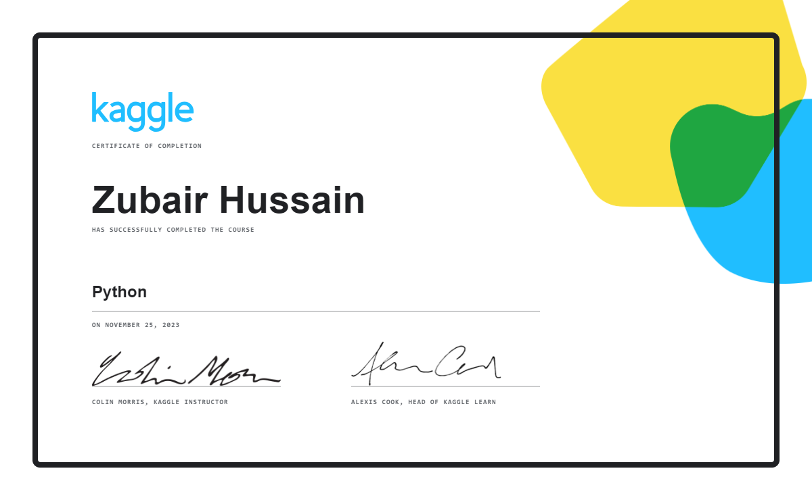
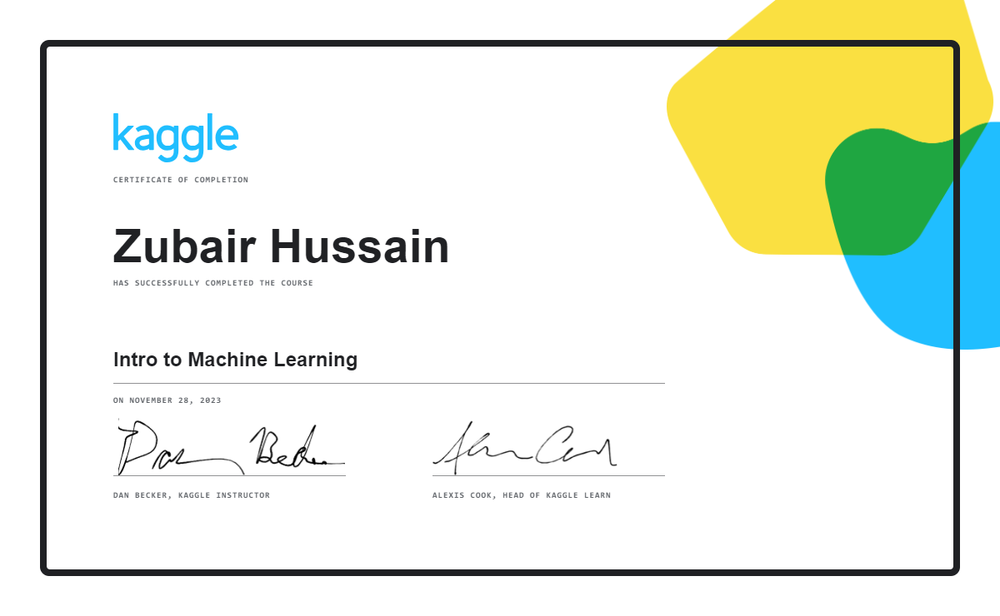
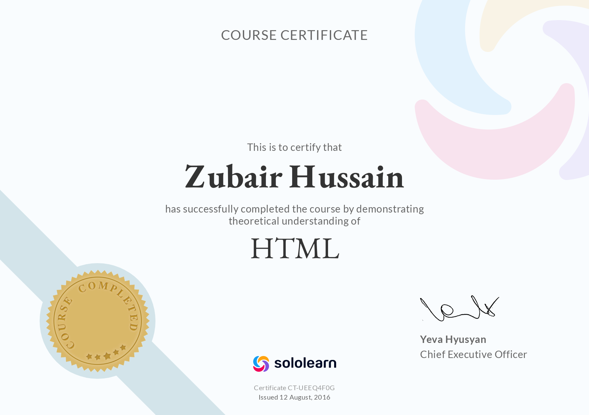
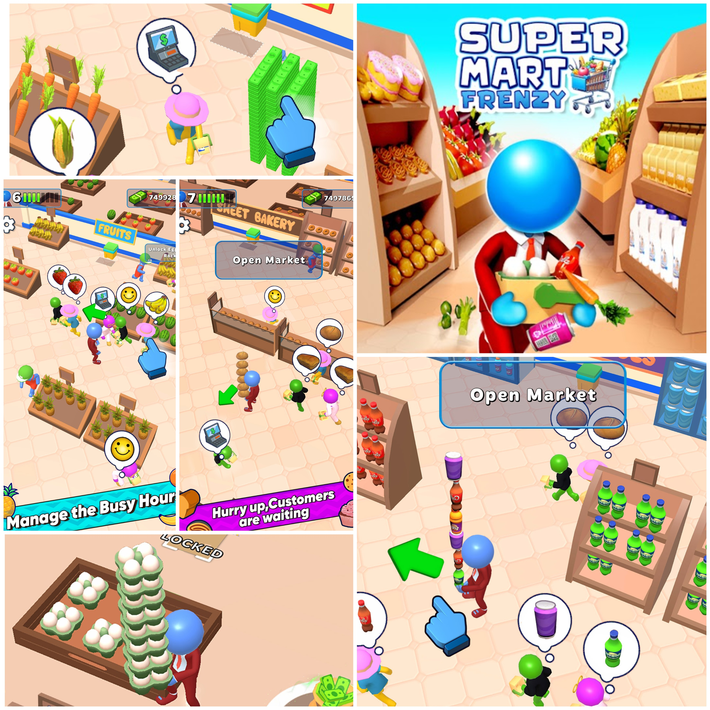
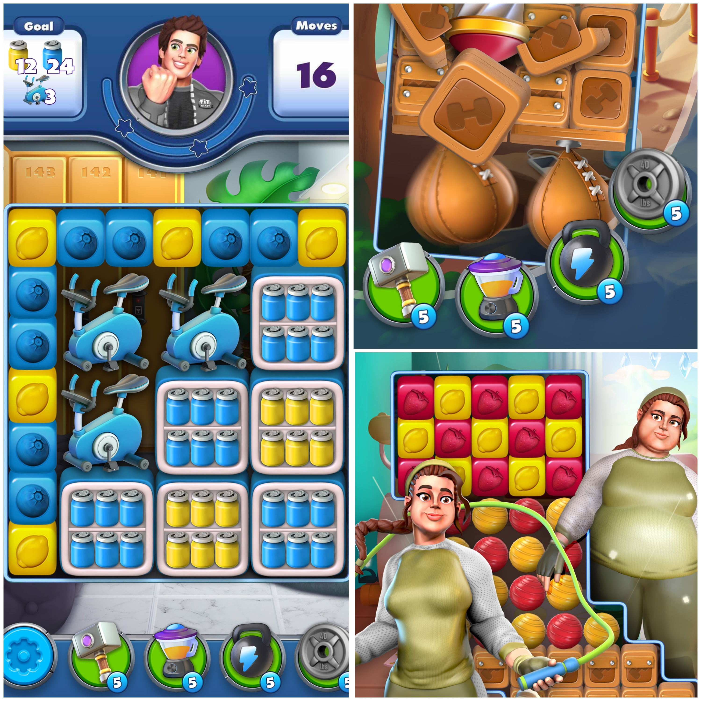
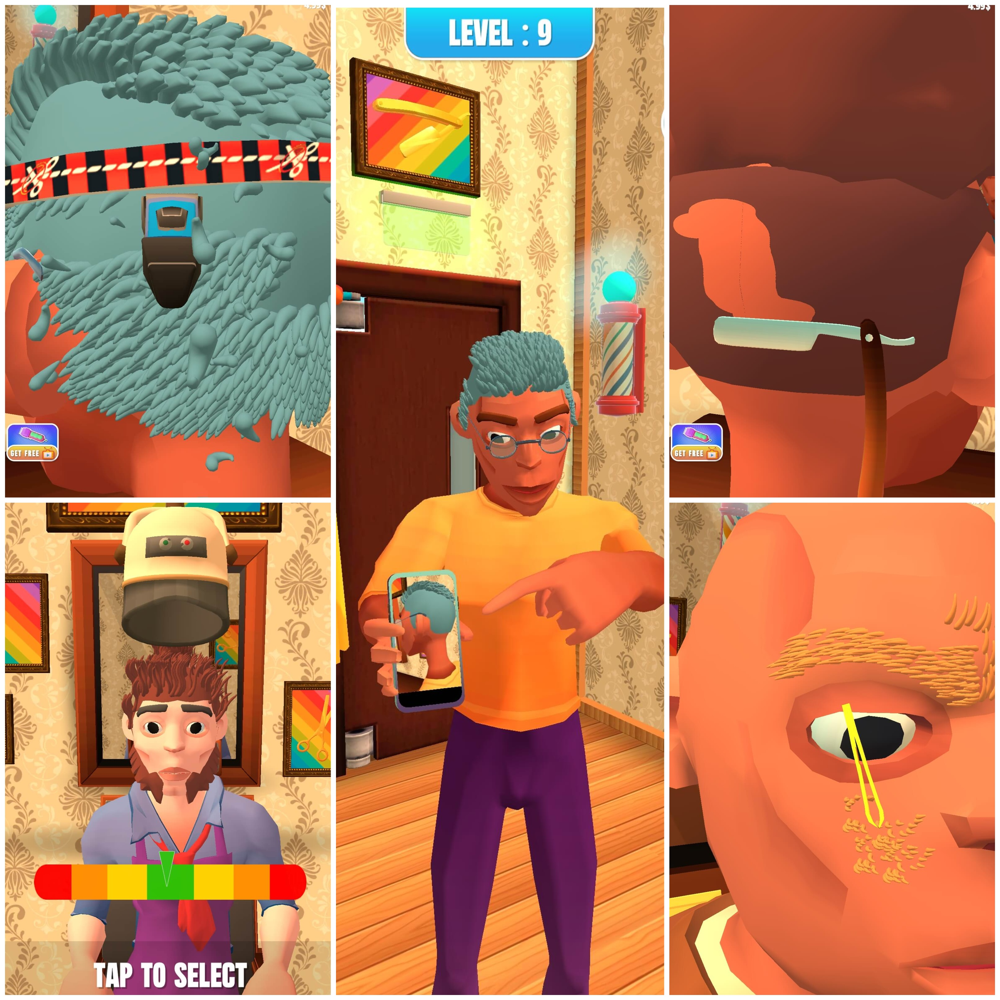
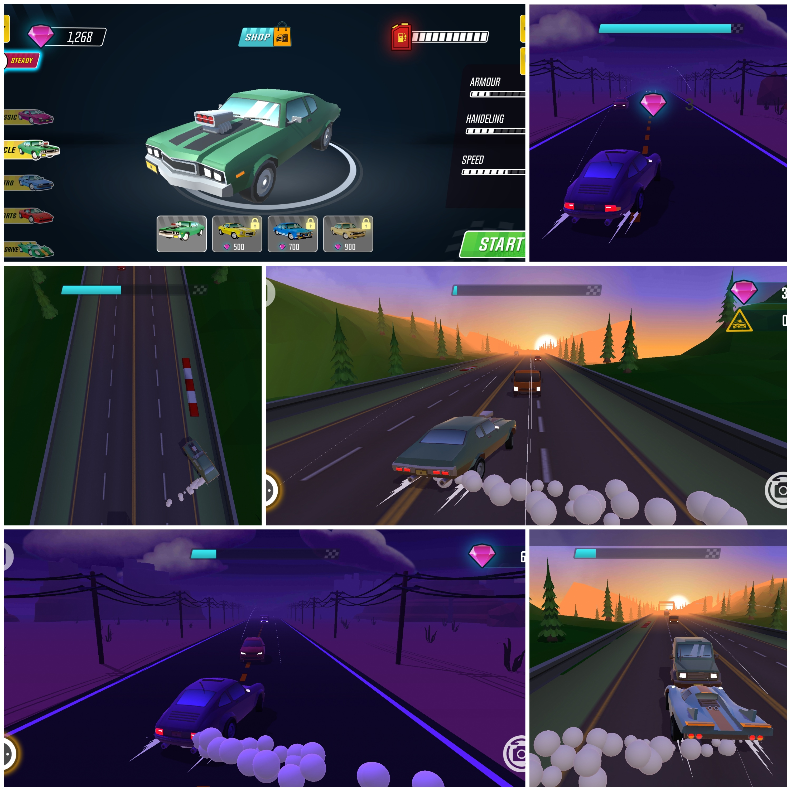
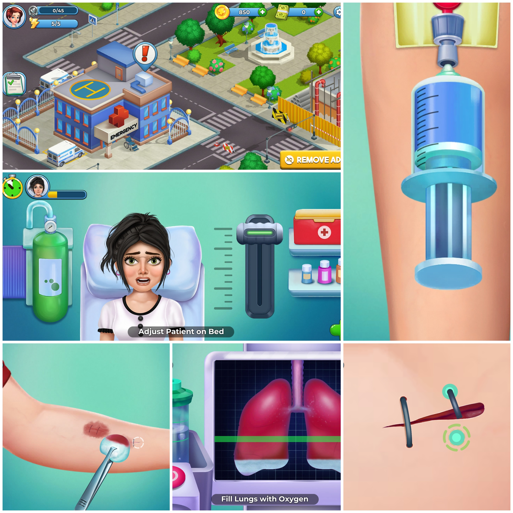
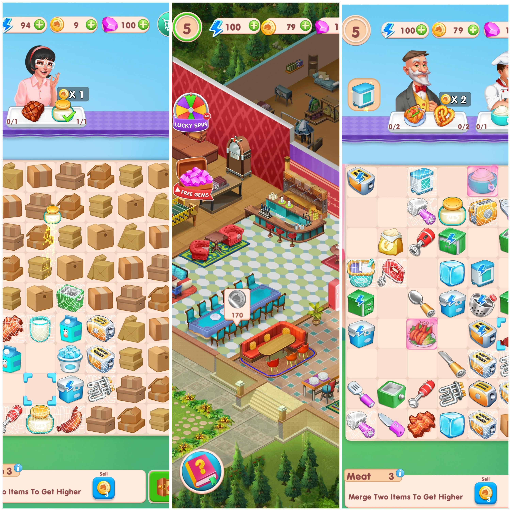

# `< Zubair Hussain />`

### Senior Full Stack & Game Developer

---

---

## 🧑‍💻 About Me

> *"Building scalable apps and immersive games that deliver exceptional user experiences."*

I'm a **Senior Software Engineer** with **5+ years of experience** specializing in **C# and JavaScript development** — crafting everything from AAA-style mobile games to enterprise full-stack platforms.

<table>
<tr>
<td width="50%">

**🎮 Game Development**
- Unity 3D (Mobile, AR/VR)
- Phaser.js (2D Browser Games)
- C# · Game Architecture · Physics

</td>
<td width="50%">

**🌐 Full Stack Development**
- React JS · ASP.NET Core
- SQL Server · PostgreSQL
- REST APIs · Microservices

</td>
</tr>
<tr>
<td width="50%">

**🛒 CMS & E-commerce**
- WordPress · WooCommerce
- Shopify · Liquid Templating
- Custom Themes & Plugins

</td>
<td width="50%">

**🧠 Other Skills**
- Python · Machine Learning Basics
- CI/CD · Azure · Git
- Agile · Clean Architecture

</td>
</tr>
</table>

## 📊 Stats at a glance

---

<h2>📬 Contact Me &nbsp;<i>(click to expand)</i></h2>

 

| Channel | Link |
|--------|------|
| 🌐 **Website** | [zubaircodes.com](https://zubaircodes.com/) |
| ✉️ **Email** | [zubairhussain404@gmail.com](mailto:zubairhussain404@gmail.com) |
| 📅 **Book a Call** | [Calendly — 30 min](https://calendly.com/zubairhussain404/30min) |

 

---

<h2>🏆 Certifications &nbsp;<i>(click to expand)</i></h2>

 

<table>
<tr>
<td align="center" width="50%">
   
  <b>C# Programming</b>
</td>
<td align="center" width="50%">
   
  <b>Python Development</b>
</td>
</tr>
<tr>
<td align="center" width="50%">
   
  <b>Machine Learning</b>
</td>
<td align="center" width="50%">
   
  <b>HTML5 Fundamentals</b>
</td>
</tr>
<tr>
<td align="center" width="50%">
   
  <b>CSS3 & Styling</b>
</td>
<td align="center" width="50%">
</td>
</tr>
</table>

---

<h2>💼 Portfolio &nbsp;<i>(click to expand)</i></h2>

 

<h3>🎮 Unity &amp; Game Portfolio &nbsp;<i>(click to expand)</i></h3>

 

<table>
<tr>
<td align="center" width="50%">

### 🛒 Super Mart Frenzy

An **arcade idle supermarket management game** where players grow a small mart into a bustling empire. Manage inventory, upgrade racks, and optimize store layouts to maximize profits.

</td>
<td align="center" width="50%">

### 🧩 Fitness Match

A **colorful casual puzzle game** where players tap same-colored cubes, trigger explosive boosters, and progress through increasingly challenging levels.

</td>
</tr>
<tr>
<td align="center" width="50%">

### 💈 Barber Simulator

A **fun toonish 3D simulation game** — take on haircut and beard styling requests with precision tools, time challenges, and progressive difficulty.

</td>
<td align="center" width="50%">

### 🚗 Dare Drive

An **endless toon-style arcade racing game** — dodge highway traffic, upgrade cars, and race through dynamic environments across multiple modes.

</td>
</tr>
<tr>
<td align="center" width="50%">

### 🏥 Carefort

A **2D hospital simulation game** — step into Dr. Alice's shoes. Diagnose patients, perform surgeries, handle emergencies, and build a thriving hospital.

</td>
<td align="center" width="50%">

### 🍳 Kitchen Merge

A **cozy 2D merge & décor puzzle game** — combine matching items, craft kitchen goodies, decorate your café, and advance through offline merge challenges.

</td>
</tr>
</table>

📂 **[See More Projects on Google Drive →](https://drive.google.com/drive/folders/1g4GtXKvYJ1Ixjrn2TXf38okHin20zanF)**

 

<h3>🌐 Full Stack Portfolio &nbsp;<i>(click to expand)</i></h3>

 

> 🚧 Projects coming soon — visit [zubaircodes.com](https://zubaircodes.com/) for live demos.

 

<h3>🔷 WordPress Portfolio &nbsp;<i>(click to expand)</i></h3>

 

> 🚧 Projects coming soon — visit [zubaircodes.com](https://zubaircodes.com/) for live demos.

 

<h3>🛍️ Shopify Portfolio &nbsp;<i>(click to expand)</i></h3>

 

> 🚧 Projects coming soon — visit [zubaircodes.com](https://zubaircodes.com/) for live demos.

 

---

**Tech Stack**

 

*✨ "Let's craft gaming marvels and digital experiences together!" ✨*

