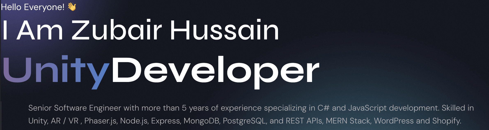
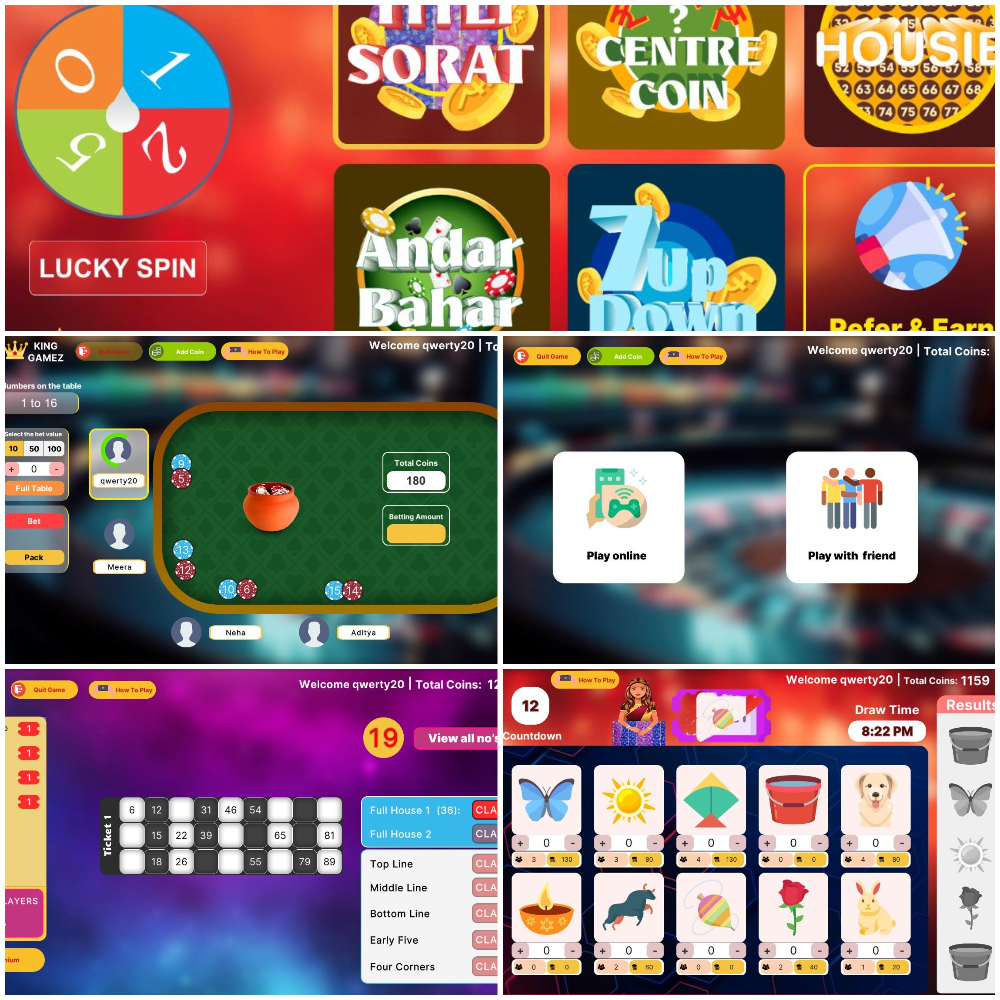
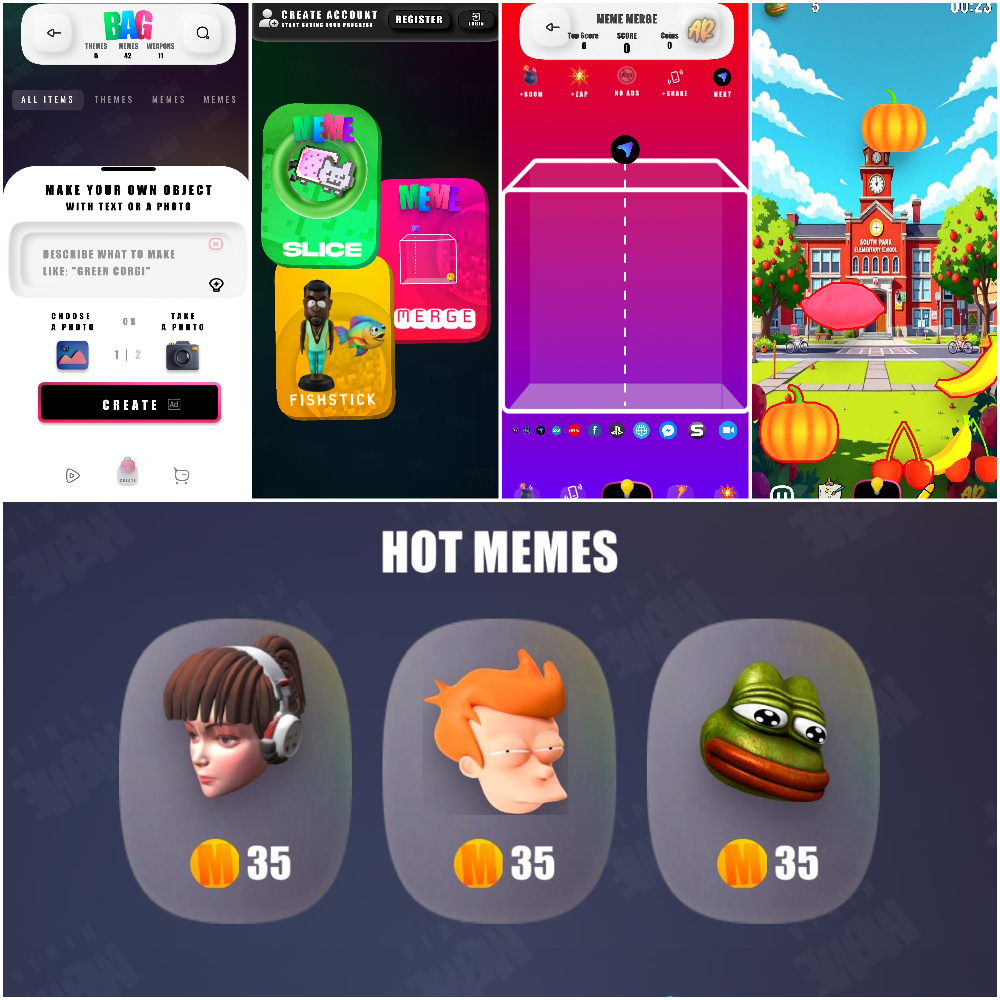
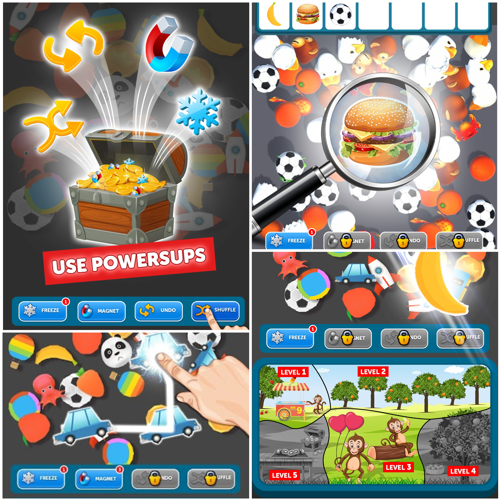

<!-- BANNER IMAGE -->
<!-- 

  

 -->

<h1 align="center">👨‍💻 Senior Full Stack Software Engineer</h1>
<h3 align="center">Unity 3D | ASP Dot Net | React JS | WordPress | Shopify</h3>

---

<!-- MENU BAR -->

  
  
  
  

---

## 🖤💙 About Me  

I’m a **Senior Software Engineer** with more than **5 years of experience** specializing in **C# and JavaScript development**.  

💙 My expertise includes:  
- 🎮 **Game Development**: Unity 3D, AR/VR, Phaser.js  
- 🌐 **Full Stack Development**: React js, Asp Dot Net, Sql Server, PostgreSQL, REST APIs  
- 🛒 **CMS & E-commerce**: WordPress, Shopify  

💡 Passionate about building **scalable apps and immersive games** that deliver exceptional user experiences.  

  

---

## 📬💙 Contact Me  

  
  <!--  -->
  <!--  -->
  
  

  

---
## 🏆 Certifications  

<table>
  <tr>
    <td align="center">
      <b>C# – by SoloLearn</b> 
      
    </td>
    <td align="center">
      <b>Python – by Kaggle</b> 
      
    </td>
  </tr>

  <tr>
    <td align="center">
      <b>Intro To Machine Learning – by Kaggle</b> 
      
    </td>
    <td align="center">
      <b>HTML – by SoloLearn</b> 
      
    </td>
  </tr>

  <tr>
    <td align="center">
      <b>CSS – by SoloLearn</b> 
      
    </td>
    <td></td>
  </tr>
</table>

  

---

## 🎮💙 Portfolio  

### 🛒 Super Mart Frenzy  
  
An arcade idle supermarket management game where players grow a small mart into a bustling supermarket empire. You manage inventory, upgrade racks, and optimize store layouts to maximize profits and efficiency.  

<!--
---

### 🎲 Titli Sorat  
  
A 2D casino-style game featuring multiple betting mini-games. Built with a custom Node.js multiplayer server and Unity frontend, it delivers smooth, real-time interactive gameplay.  

---

### 🥷 Meme Ninja  
  
A 3D mini-game collection with a generative AI twist. Players interact with AI-generated models created from text-to-3D and image-to-3D generation, blending cutting-edge AI with engaging gameplay.  

---

### 🧩 Fitness Match  
  
A colorful casual puzzle game where players tap on same-colored cubes, trigger explosive boosters, and progress through increasingly challenging levels.  
-->

---

### 💈 Barber Simulator  
  
A fun and toonish 3D simulation game where players take on haircut and beard styling requests. Precision tools, time challenges, and progressive difficulty create engaging barber shop gameplay.  

---

### 🚗 Dare Drive  
  
An endless toon-style arcade racing game where players dodge highway traffic, upgrade their cars, and race through dynamic environments across different modes to reach the top.  

---

### 🏥 Carefort  
  
A 2D hospital simulation game where players step into the shoes of Dr. Alice. From diagnosing patients to performing surgeries and handling emergencies, players build and manage a thriving hospital.  

---

### 🍳 Kitchen Merge  
  
A cozy 2D merge and decor puzzle game where players combine matching items to craft kitchen goodies, decorate their café, and advance through offline merge challenges.  

---

### 👑 Match 3 Royale  
  
A fast-paced 3D puzzle game where players find and match three identical objects against the clock. Boosters and strategies help clear targets while difficulty ramps up with each level. 

---

📂 **See More Projects → [Portfolio Read More](https://drive.google.com/drive/folders/1g4GtXKvYJ1Ixjrn2TXf38okHin20zanF)**  

  

---

✨ <b>“Let’s craft gaming marvels together!”</b> ✨

